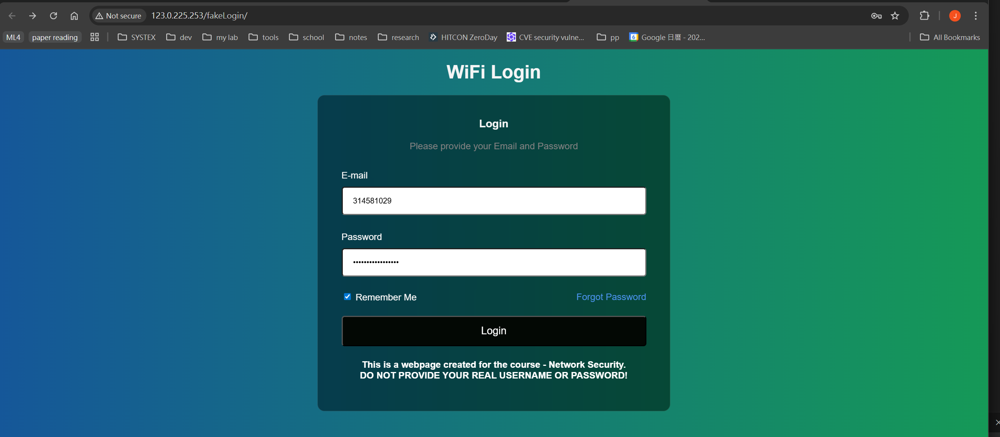
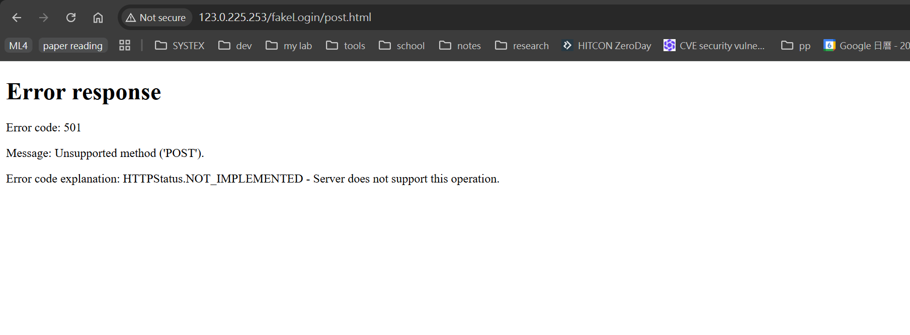
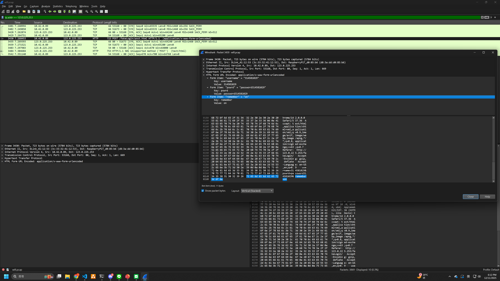

# Homework 7 - [Group Assignment] Shadow IT and WiFi MiTM

## Part 2: Fake AP and MITM Attack

### step 1: Setting up the AP on Attacker's Device (pi5)
on soft AP (attacker's pi5):
```bash
james@pi5:~$ sudo tcpdump -i wlan0 -w wifi.pcap
[sudo] password for james: 
tcpdump: listening on wlan0, link-type EN10MB (Ethernet), snapshot length 262144 bytes
^C3869 packets captured
4371 packets received by filter
0 packets dropped by kernel
```

### step 2: Connecting to the AP
on victim's pc:

connect to http://123.0.225.253/fakeLogin/ and enter e-mail and password:



### step 3: Analyzing the Captured Traffic
on attacker's pc:
Analyze the `wifi.pcap` file using Wireshark to identify any sensitive information transmitted over the network.
Look for unencrypted HTTP traffic, login credentials, or any other sensitive data that could be exploited.
