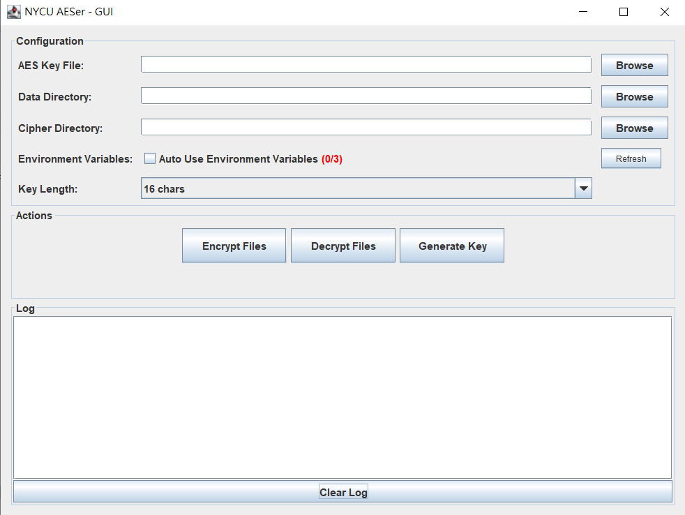
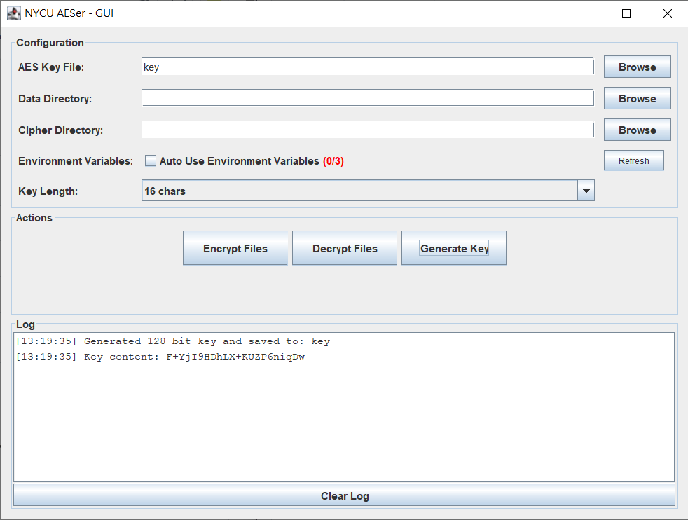
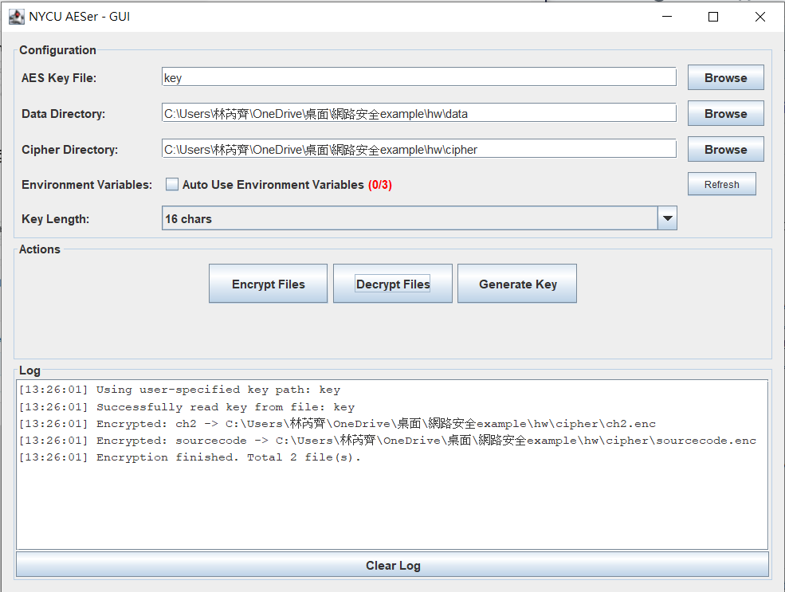
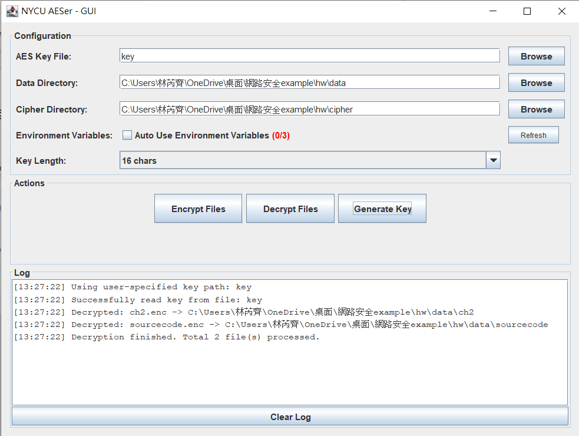

# Chapter 2 - Cryptography Fundamentals

This project is developed in Java and provides a complete solution for batch file encryption and decryption using the Advanced Encryption Standard (AES) algorithm. It supports AES-128, AES-192, and AES-256 with flexible key generation and management.

Key features include a graphical user interface (GUI) for easy interactive operations, as well as a console mode that enables scripting and automation. The tool allows users to generate secure random AES keys (stored as Base64), encrypt or decrypt all files in a specified source directory, and output results to a designated target directory. We also display real-time logs in the GUI, showing detailed status messages and errors during encryption/decryption processes

The application supports the use of environment variables for configuration, making it easy to integrate into automated workflows or containerized environments, such as Docker. Additionally, it is compatible with major desktop platforms (Windows, Linux, macOS) and can run inside a Java development container.

## Introduction of why you decide to use this cryptosystem instead of others

We choose AES to be our cryptosystem since we have already tried RSA in the class.

## The difficult points you've figured during implementation (Or where to you find such resources.)


## Additional features you've implemented

### Feature of GUI Mode

* User-friendly interface to configure AES key file, data directory, and cipher output directory
* Supports file and directory selection using native system file chooser dialogs (JFileChooser)
* Support recursive file encryption and decryption as an option
* Allows direct drag-and-drop of files or folders from the system file explorer into the input fields for quick path setting
* Automatic environment variable detection and loading for key and directory paths with toggle option
* Automatic aes key generation
* Key length selection combobox with options for 128, 192, and 256-bit AES keys
* Real-time log display area showing detailed status updates and error messages during operations
* Clear log button for log management



### Generate 16 bytes Key



### Encrypt File



### Decrypt File



## The contribution table of each group members

314581007 吳念澤: implementation of AesCore.java
314581019 李紹民: working on other group assignment
314581025 徐葆驊: implementation of AesGui.java
314581029 盧楷勛: implementation of AesCore.java, refactoring and writing readme
314581038 林芮齊: improvement of AesGui.java and writing readme
314706023 何孟修: working on other group assignment

## build

```bash
javac -d bin src/nycu/**/*.java
```

## run

```bash
# GUI mode
java -cp bin nycu.main.aeser
# TUI mode
java -cp bin nycu.main.aeser console
```

## set up env (linux)

```bash
export AES_KEY_FILE_PATH=key
export AES_DATA_DIR=data
export AES_CIPHER_DIR=cipher
```

## working java container

```bash
docker run -v ./hw:/app/hw -it openjdk:21-jdk-slim bash
```
